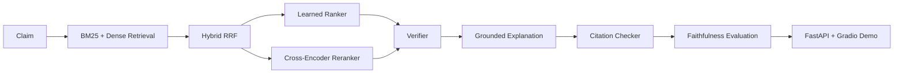

# Veritas

Veritas | Transformer-Based Fact Verification with Hybrid Retrieval, Cross-Encoder Ranking, and Citation Faithfulness Evaluation

Veritas is a reproducible factual claim verification project.
It takes a claim through evidence retrieval, evidence ranking, claim verification, grounded explanation, citation validation, and faithfulness evaluation, then serves the system through FastAPI and Gradio.

## Results

These numbers come from the checked-in reports under `reports/`. They are sample-scale and should be read as regression artifacts, not broad model claims.

| Component | Metric | Value |
| --- | --- | ---: |
| Data quality | sampled records | 8 |
| Data quality | missing evidence spans | 1 |
| Data quality | average claim length | 8.0 |
| Retrieval baseline | evidence corpus size | 12 |
| Retrieval baseline | FEVER validation BM25 MRR | 1.000 |
| Neural retrieval | dense backend | `sentence-transformers/all-MiniLM-L6-v2` |
| Neural retrieval | dense Recall@1 | 0.750 |
| Neural retrieval | dense MRR | 1.000 |
| Ranking baseline | learned ranker backend | `sklearn-logistic` |
| Ranking baseline | learned MAP | 0.271 |
| Cross-encoder ranking | cross-encoder model | `cross-encoder/ms-marco-MiniLM-L-6-v2` |
| Cross-encoder ranking | cross-encoder MAP | 0.667 |
| Cross-encoder ranking | cross-encoder MRR | 0.667 |
| Verifier | sklearn checkpoint | `checkpoints/verifier/model.joblib` |
| Verifier | train / val / test accuracy | 0.750 / 0.400 / 0.333 |
| Transformer verifier | checkpoint path | `checkpoints/transformer_verifier` |
| Transformer verifier | train / val / test accuracy | 0.500 / 0.000 / 0.000 |
| Faithfulness | citation validity rate | 0.875 |
| Faithfulness | verdict consistency rate | 0.875 |
| Error analysis | mismatch count | 6 |
| Error analysis | error rate | 0.750 |
| Pareto | best frontier point | `mock-top5` |
| Pareto | frontier macro-F1 | 0.302 |
| Tests | pytest suite | 59 passed |

## Architecture



## What Is Implemented

- Sampled FEVER and SciFact processing into reproducible JSONL artifacts.
- Deterministic hashing dense retrieval for CI and a real `sentence-transformers` dense path for local neural evaluation.
- BM25, hybrid RRF, heuristic ranking, learned ranking, and optional cross-encoder reranking.
- Lightweight sklearn verifier checkpoint plus a real transformer fine-tuning path.
- Citation checking and faithfulness evaluation.
- FastAPI API and Gradio demo with caching, validation, monitoring, and fallback metadata.
- Artifact manifest generation for reports and checkpoints.

## Reproduce

```bash
make build-sample-data
make eval-retrieval
make eval-ranking
make train-verifier
make eval-faithfulness
make error-analysis
make pareto-analysis
make manifest
make verify-local
```

To reproduce the neural benchmark runs that exist in this repo:

```bash
python3 scripts/run_retrieval_eval.py \
  --split val \
  --max-queries 5 \
  --dense-backend sentence-transformers \
  --embedding-model sentence-transformers/all-MiniLM-L6-v2 \
  --output-json reports/retrieval_eval_neural.json \
  --output-md reports/retrieval_eval_neural.md

python3 scripts/run_ranking_eval.py \
  --split val \
  --max-queries 2 \
  --use-cross-encoder \
  --cross-encoder-model cross-encoder/ms-marco-MiniLM-L-6-v2 \
  --output-json reports/ranking_eval_cross_encoder.json \
  --output-md reports/ranking_eval_cross_encoder.md

python3 scripts/train_transformer_verifier.py \
  --model-name distilroberta-base \
  --max-train-examples 8 \
  --max-val-examples 4 \
  --max-test-examples 4 \
  --epochs 1 \
  --batch-size 2 \
  --output-dir checkpoints/transformer_verifier \
  --report-json reports/transformer_verifier_eval.json \
  --report-md reports/transformer_verifier_eval.md
```

## Run The Demo

Local Gradio demo:

```bash
python3 app.py
```

Optional service endpoints:

- `GET /health`
- `POST /verify`
- `GET /metrics`

If you want the API directly:

```bash
uvicorn serving.api:app --host 0.0.0.0 --port 8000
```

## Deploy To Hugging Face Spaces

Public demo URL: https://sushildalavi-veritas.hf.space

See [`DEPLOYMENT.md`](DEPLOYMENT.md) for the full step-by-step Space setup.

Short version:

1. Create a new Space.
1. Choose `Gradio` as the SDK.
1. Set Python to `3.11`.
1. Connect this repository or upload the files.
1. Verify that `app.py` launches and the UI shows verdict, confidence, evidence, citation status, backend, fallback status, and latency.

Deployment note:
- The live Space currently uses the lightweight sklearn verifier checkpoint in `checkpoints/verifier/`.
- The checkpoint is retrained from the checked-in sampled FEVER/SciFact data and stores sklearn/Python/git metadata for reproducibility.

## Production Features

- Central YAML + environment configuration in `core/config.py`.
- Artifact manifest generation in `reports/artifact_manifest.json`.
- Response caching with TTL.
- Health and metrics endpoints.
- Backend metadata in API responses.
- Fallback verifier and retrieval paths for CPU-only demo use.
- Validated request schema with claim stripping and length limits.
- Model checkpoint routing that prefers transformer checkpoints, then sklearn, then mock fallback.

## Limitations

- The dataset is deliberately tiny.
- Retrieval and ranking metrics are sample-scale regression metrics, not benchmark claims.
- The transformer verifier was trained on a tiny smoke run and does not show meaningful generalization.
- The public Spaces URL is [https://sushildalavi-veritas.hf.space](https://sushildalavi-veritas.hf.space).
- The deployed verifier is the lightweight sklearn checkpoint in `checkpoints/verifier/`, not the transformer smoke model.
- Offline QLoRA and DPO remain optional extensions, not completed training runs.

## What Not To Overclaim

- Do not claim broad production accuracy from the sample reports.
- Do not claim the public demo is deployed unless you have an actual URL.
- Do not claim QLoRA or DPO were trained unless the repo has matching checkpoints and reports.
- Do not claim the transformer verifier is a strong benchmark model; it is a smoke-run artifact.
- Do not claim the neural retrieval and cross-encoder runs were large-scale experiments.

## Resume Bullets

- Built a reproducible FEVER/SciFact verification pipeline with checked-in sample datasets, artifact manifests, and real evaluation reports.
- Added optional sentence-transformer dense retrieval, cross-encoder reranking, and transformer verifier fine-tuning paths alongside lightweight CPU fallbacks.
- Hardened the serving stack with config-driven checkpoint routing, caching, health/metrics endpoints, and Gradio/FastAPI deployment readiness.
