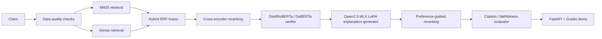

# Veritas | Trainable Evidence Retrieval, Cross-Encoder Ranking & Neural Fact Verification

Veritas is a Mac-first research system for evidence-grounded fact verification.
It combines trainable retrieval, cross-encoder reranking, transformer-based verdict prediction,
and citation-grounded explanation generation in a single reproducible workflow.

The design intentionally separates two jobs:

- verdict prediction, which is handled by a compact transformer verifier
- explanation generation, which is handled by Qwen2.5 MLX LoRA and preference-guided reranking (optional)

The verifier is the source of truth for the final label. The explanation model is not allowed to replace it.

## Why It Exists

Veritas is built to answer a practical research question: how far can a fully local, Mac-compatible
verification stack go without relying on CUDA, Colab, Kaggle, or bitsandbytes?

The measured bottleneck is **evidence retrieval and ranking**: the verifier performs well when
given gold (oracle) evidence, but drops sharply on retrieved evidence. On the full available v2
test set (650 examples, all of `fever_test_large` + `scifact_test_large`), oracle per-passage
macro-F1 is 0.6728 while retrieved per-passage macro-F1 is 0.3887 (recall@10 0.5334) -- a gap of
0.2841. The smaller 100- and 200-example slices showed more favorable absolute numbers (oracle
~0.72, retrieved ~0.46-0.47), which the full-set run shows was sample variance rather than a
reflection of true performance; the oracle-vs-retrieved gap itself is consistent (~0.25-0.39)
across all slice sizes. The project's focus is closing that gap through a fine-tuned bi-encoder
retriever, a fine-tuned cross-encoder reranker, and a verifier trained to be robust to retrieval
noise.

The answer here is not "perfect" or "SOTA." It is a measured, honest stack with real retrieval, ranking, verifier, faithfulness, and latency tradeoffs.

## Key Results

All numbers below are measured on checked-in sample-scale evaluation runs.

| Component | Result |
| --- | --- |
| Verifier dataset | 2808 train / 649 val / 642 test (cross-split duplicate claim/evidence/label triples removed; see `reports/verifier_data_audit.md`) |
| Sklearn verifier | 0.484 accuracy, 0.482 macro-F1 |
| DistilRoBERTa verifier* | 0.718 accuracy, 0.711 macro-F1 |
| DistilRoBERTa REFUTED recall* | 0.745 |
| Oracle evidence verifier | 0.717 accuracy, 0.710 macro-F1 |
| End-to-end verifier with retrieved evidence | 0.440 accuracy, 0.414 macro-F1 |
| Oracle vs retrieved v2 (diagnostic 20-sample slice) | oracle 0.709 macro-F1, retrieved 0.500 macro-F1, recall@10 0.667 |
| Oracle vs retrieved v2 (100-sample slice) | oracle 0.7211 macro-F1, retrieved 0.4615 macro-F1, recall@10 0.5435 |
| Oracle vs retrieved v2 (200-sample slice) | oracle 0.7206 macro-F1, retrieved 0.4715 macro-F1, recall@10 0.4711 |
| Oracle vs retrieved v2 (full 650-example test set, primary result) | oracle 0.6728 macro-F1, retrieved 0.3887 macro-F1, recall@10 0.5334, gap 0.2841 |
| Threshold comparison on 100-sample slice | per-passage macro-F1 0.441 -> 0.462, NEI false-positive rate 0.807 -> 0.613 |
| Top-k retrieved verifier (BM25 top-5) | 0.460 accuracy, 0.454 macro-F1 |
| Retrieval ablation (MiniLM, val split) | 0.558 recall@10, above BM25 at 0.461 |
| Dense retrieval | 0.357 recall@1, 0.524 recall@10 |
| Hybrid retrieval | 0.535 recall@10 |
| Cross-encoder ranking | 0.540 MAP, 0.562 MRR, 0.565 nDCG@10 |
| Template faithfulness | 0.560 citation validity, 0.755 verdict consistency |
| MLX LoRA explanation adapter | 0.695 verdict accuracy, 0.4632 macro-F1, 0.600 citation validity |
| DeBERTa challenger (xsmall) | 0.636 accuracy, 0.537 macro-F1, 0.036 refuted recall (macro-F1 below 0.55 threshold; REFUTED recall still low) |
| Final audit package | Oracle, retrieved, top-k, retrieval ablation, faithfulness, and Pareto summaries |
| Tests | 107 passed |

The most important signal is the oracle-vs-retrieved gap: retrieval quality still limits end-to-end verifier performance. Each successive enlargement of the evaluation set (20 -> 100 -> 200 -> 650 examples) made the absolute numbers less flattering -- the full 650-example test set is the most representative result and should be treated as the project's primary headline number.

\* These rows were measured on the verifier dataset before the cross-split dedup above (2809/650/650). They are stale pending a retrain on the deduped 2808/649/642 split; the sklearn and DeBERTa rows have already been re-measured on the deduped split. The earlier DeBERTa run was also degenerate due to a separate bug: `microsoft/deberta-v3-xsmall` loads in fp16 by default on this transformers version, and training fp16 on CPU produced NaN gradients (`grad_norm: nan`, all predictions collapsed to SUPPORTED). Fixed by passing `dtype=torch.float32` in `_load_transformer()` in `scripts/train_transformer_verifier_clean.py`.

## Retrieval Profile Comparison

Measured on a 50-example slice of `fever_test_large` + `scifact_test_large` (see
`reports/retrieval_profile_comparison.md`). All profiles below ran end-to-end on CPU; none were
skipped or faked.

| Profile | recall@10 | nDCG@10 | Retrieved per-passage macro-F1 |
| --- | --- | --- | --- |
| bm25_only | 0.601 | 0.5678 | 0.3693 |
| dense_only (hashing embeddings) | 0.1507 | 0.0801 | 0.281 |
| hybrid_bm25_dense (hashing embeddings) | 0.5713 | 0.5168 | 0.4748 |
| hybrid_with_query_expansion (hashing) | 0.597 | 0.5796 | 0.4124 |
| hybrid_with_reranker (hashing + cross-encoder) | 0.621 | 0.6083 | 0.3976 |
| hybrid_bm25_sentence_transformer (real MiniLM dense) | 0.6377 | 0.6106 | 0.4595 |

Notes:

- `dense_only` with hashing embeddings is intentionally weak; it exists as a baseline, not a
  recommended configuration.
- The real MiniLM-based hybrid (`hybrid_bm25_sentence_transformer`) gives the best retrieval
  metrics (recall@10, nDCG@10) of any profile measured here, but the hashing-based
  `hybrid_bm25_dense` still has the best per-passage verifier macro-F1 at this 50-example sample
  size. Better retrieval ranking metrics do not monotonically translate into better verifier
  macro-F1 in this slice -- both numbers are reported rather than picking one as "the" winner.
- The cross-encoder reranker profile (`hybrid_with_reranker`) improves recall@10 and nDCG@10 over
  the unreranked hashing hybrid but does not improve per-passage macro-F1 on this slice.

## Architecture



## What Is Implemented

- Reproducible FEVER and SciFact preprocessing
- Large and small sample pipelines for retrieval and verifier evaluation
- BM25, dense retrieval, hybrid reciprocal-rank fusion, and cross-encoder reranking
- DistilRoBERTa verifier with lightweight sklearn fallback
- DeBERTa challenger path for comparison and future selection
- DeBERTa challenger training and evaluation path with a measurable checkpoint
- Qwen2.5 MLX LoRA explanation generation on Apple Silicon
- Preference-guided explanation reranking as the Mac-compatible alternative to DPO
- Citation checking, faithfulness scoring, and explanation diagnostics
- Final evaluation suite and research audit packaging
- FastAPI service with response caching, fallback metadata, and health/metrics endpoints
- Gradio demo with a polished research-facing layout

## LLM Inference and Runtime Benchmarking

Veritas includes an "Inference Performance Lab" that benchmarks the
production verifier and explanation-generation paths -- latency, throughput,
batching, and fallback behavior, all measured (not estimated):

- **Verifier (PyTorch, CPU/MPS)**: `scripts/benchmark_verifier_runtime.py`
  measures forward-pass latency/throughput across batch sizes for the
  production `transformer_verifier_clean` checkpoint. On this machine, MPS
  gives ~2.4x the CPU throughput at batch size 32 (364 vs 154 examples/sec).
- **Explanation generation (transformers, CPU/MPS)**: `scripts/benchmark_inference_serving.py`
  measures local-generation latency and tokens/sec for a small causal LM
  (TinyLlama-1.1B).
- **vLLM serving**: the same script health-checks an OpenAI-compatible vLLM
  endpoint and measures concurrent request throughput if one is running;
  otherwise it writes a `status: skipped` report with the exact command to
  start one. `serving/vllm_client.py` retries on connection errors and falls
  back to a well-formed JSON response after exhausting retries.
- **ONNX Runtime (verifier, CPU)**: `scripts/export_verifier_onnx.py` and
  `scripts/benchmark_verifier_onnx.py` export the verifier checkpoint to ONNX
  and measure `onnxruntime` CPU latency/throughput. On this machine, the
  default ONNX Runtime CPU provider is slower than the PyTorch CPU baseline
  (no ONNX speedup is claimed here).
- **Triton (GPU)**: `scripts/benchmark_triton_dense_scoring.py` is a runnable
  script that writes a `status: skipped` report with the required
  CUDA/Triton environment on machines without a GPU (the case for this
  development machine).

Veritas now includes runtime benchmarking across Transformers fallback, vLLM
endpoint serving, optional ONNX Runtime verifier inference, and optional
Triton dense-scoring kernels.

See `docs/inference_performance.md` for full results and
`docs/inference_runtime_landscape.md` for architecture notes on
SGLang/MLC-LLM/FlashAttention/TVM-MLIR relative to Veritas's bottlenecks.

## Live Demo

Public demo: [https://sushildalavi-veritas.hf.space](https://sushildalavi-veritas.hf.space)

The demo exposes:

- verdict
- confidence
- evidence
- citation validity
- retrieval backend
- reranker backend
- verifier backend
- fallback status
- latency

## Run Locally

```bash
make test
make lint
make demo
```

Optional API server:

```bash
make serve
```

vLLM-backed explanation serving:

```bash
make serve-vllm-explanations
VERITAS_CONFIG=configs/vllm_serving.yaml python3 -m uvicorn serving.api:app --reload
```

Larger verifier eval:

```bash
python3 scripts/eval_oracle_vs_retrieved_v2.py --config configs/serving.yaml --max-examples 100 --report-json reports/oracle_vs_retrieved_v2_100.json --report-md reports/oracle_vs_retrieved_v2_100.md
python3 scripts/eval_oracle_vs_retrieved_v2.py --config configs/serving.yaml --max-examples 200 --report-json reports/oracle_vs_retrieved_v2_200.json --report-md reports/oracle_vs_retrieved_v2_200.md
python3 scripts/eval_oracle_vs_retrieved_v2.py --config configs/serving.yaml --max-examples 650 --report-json reports/oracle_vs_retrieved_v2_full.json --report-md reports/oracle_vs_retrieved_v2_full.md
```

Retrieval profile comparison (bm25, dense, hybrid, query expansion, cross-encoder reranker, real MiniLM hybrid):

```bash
python3 scripts/compare_retrieval_profiles.py --config configs/serving.yaml --max-examples 50
```

## Research Workflow

Veritas is designed around a simple local research loop:

1. check dataset and evidence quality
2. retrieve candidate evidence
3. rerank the evidence
4. predict the verdict with the transformer verifier
5. generate an explanation conditioned on that verdict
6. validate citations and unsupported statements
7. compare metrics across retrieval, ranking, verifier, and explanation variants

That separation matters:

- the small language model should not be the verdict classifier
- explanation faithfulness should be evaluated separately from label accuracy
- retrieval quality should be measured independently from verifier quality

## Research Mode vs Live Mode

Live mode:

- BM25-first retrieval
- transformer verifier or sklearn fallback
- CPU-friendly
- minimal dependencies

Research mode:

- dense retrieval with sentence transformers
- hybrid fusion
- cross-encoder reranking
- MLX LoRA explanation generation
- preference-guided reranking
- deeper evaluation and ablation coverage

## Limitations

- The evaluation sets are sample-scale (650-example test set), not the full FEVER benchmark.
- End-to-end performance is materially worse than oracle evidence performance.
- Feeding top-5 retrieved evidence improves end-to-end macro-F1 to 0.454 on the smaller verifier dataset slice used for that result, but the larger 650-example v2 set shows a wider oracle gap (0.6728 vs 0.3887 per-passage macro-F1); the oracle gap is still material either way.
- The 20-, 100-, and 200-sample v2 reports are smaller diagnostic slices; the full 650-example v2 report is the primary checked-in verifier comparison and should be cited first.
- All v2 reports (20/100/200/650) use the `bm25_only` serving profile and no reranker; they should not be described as a hybrid result.
- The retrieval profile comparison (50-sample slice) measures `dense_only` and `hybrid_bm25_dense` with hashing embeddings as cheap baselines, and separately measures a real MiniLM-based hybrid (`hybrid_bm25_sentence_transformer`) and a cross-encoder reranker hybrid (`hybrid_with_reranker`); none of these profiles were skipped.
- Threshold calibration and threshold comparison are still slice-based, not final benchmark-wide calibration.
- Citation faithfulness is measured, not assumed.
- The MLX LoRA explanation adapter is a small-sample result, not a benchmark claim.
- Preference-guided reranking is a deterministic Mac-compatible replacement for DPO, not DPO itself.
- Phi-3 QLoRA and DPO training paths are scaffolded, but no real Phi-3 checkpoint is claimed in this repo unless the adapter directories exist.
- The vLLM path is explanation-serving only. The verifier model still decides the label, and the checked-in vLLM benchmark is currently a skipped report because no live endpoint was available in this environment.

## Repository Guides

- `docs/architecture_audit.md`
- `docs/retrieval_ceiling.md`
- `docs/vllm_serving.md`
- `docs/phi3_gpu_training.md`
- `docs/inference_performance.md`
- `docs/inference_runtime_landscape.md`

## Do Not Overclaim

- Do not call the project SOTA.
- Do not claim production-scale benchmark coverage.
- Do not claim perfect faithfulness.
- Do not describe preference reranking as DPO.
- Do not describe the MLX adapter as QLoRA.
- Do not hide the oracle-vs-retrieved gap.

## Resume-Safe Summary

Veritas is a Mac-compatible research and production ML project for evidence-grounded fact verification, with hybrid retrieval, transformer verdict classification, MLX LoRA explanation generation, and preference-guided explanation reranking.

**Resume bullet (inference performance):** Built an inference benchmarking
suite measuring PyTorch verifier latency/throughput across batch sizes and
devices (CPU/MPS), local and vLLM-served LLM explanation generation with
retry/fallback handling, and added ONNX Runtime and Triton GPU benchmark
scaffolds that run and report cleanly on hardware without those dependencies.
