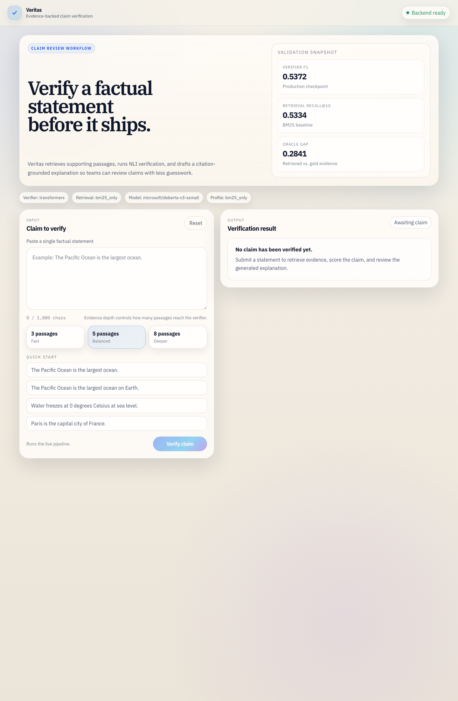
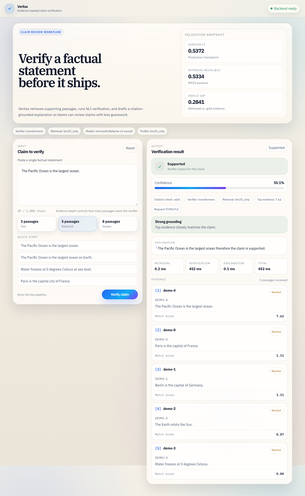

# Veritas

**Claim verification for publishing and review workflows.** Paste a factual statement, retrieve supporting evidence, and review a citation-grounded verdict in one browser workspace.

Built for editorial checks, customer-facing copy review, and internal QA where a human needs a fast, evidence-backed answer before something ships.

---

## Product flow

1. **Paste a claim** into the workspace
2. **Choose evidence depth** to balance speed and coverage
3. **Verify** against the live backend
4. **Review the verdict, confidence, explanation, and evidence**
5. **Use the result** in editorial or review workflows

---

## Screenshots

**Verify a claim** - focused workspace with service status, validation snapshot, and quick-start examples



**Evidence + Verdict** - live result view with confidence, citation check, latency, and retrieved sources



---

## Getting started

### Prerequisites

- Python 3.11+
- Node.js 18+

### Install

```bash
# Python dependencies
make install

# Frontend dependencies
make frontend-install
```

### Run

```bash
# Terminal 1 — start the API server
make api
# → http://localhost:8000

# Terminal 2 — start the frontend
make frontend
# → http://localhost:5173
```

Open [http://localhost:5173](http://localhost:5173) and enter a claim to verify.

---

## Tech stack

| Layer | Technology |
|-------|-----------|
| Frontend | React, TypeScript, Vite |
| Backend | Python, FastAPI |
| Verification | DeBERTa challenger checkpoint by default, with the DistilRoBERTa baseline preserved in reports |
| Evidence retrieval | BM25 full-text search by default, with optional neural/hybrid modes in config |
| Explanation | Template fallback or MLX LoRA adapter, depending on backend availability |
| Infrastructure | Local-first with artifact checks, caching, and explicit runtime metadata |

---

## Architecture

```
Claim
  │
  ├─► Retrieval
  │     └─► BM25 by default, optional dense/hybrid profiles in config
  │
  ├─► Verification
  │     └─► DistilRoBERTa / DeBERTa checkpoint with cached responses
  │     └─► Confidence aggregation → final verdict
  │
  └─► Explanation
        └─► Template fallback or MLX LoRA-backed grounding
        └─► Citation validation before the response is returned
```

### API Endpoints

| Method | Path | Description |
|--------|------|-------------|
| `GET` | `/health` | Service status and active backend metadata |
| `GET` | `/metadata` | Project summary, measured validation metrics, artifact checks |
| `GET` | `/metrics/summary` | Runtime snapshot for requests, latency, and cache usage |
| `POST` | `/pipeline` | Full verification pipeline: retrieve, verify, explain |
| `POST` | `/verify` | Verification only |
| `POST` | `/retrieve` | Evidence retrieval only |
| `POST` | `/explain` | Explanation generation only |
| `GET` | `/reports/{name}` | Allowlisted report content for published research summaries |

---

## Project structure

```
serving/          → FastAPI backend, model loading, caching, runtime metadata
frontend/         → React + Vite + TypeScript claim-verification workspace
models/           → NLI verifier checkpoints and model routing
retrieval/        → BM25, dense, and hybrid retrieval implementations
ranking/          → Cross-encoder and heuristic reranking
rag/              → Explanation generation and citation checking
agent/            → Reflection loop for pipeline orchestration
core/             → Configuration and shared utilities
data/             → Data preprocessing and corpus building
evaluation/       → Validation metrics and analysis
scripts/          → Training, evaluation, and export scripts
configs/          → YAML configuration profiles
```

---

## CLI

```bash
python cli.py "The Apollo 11 mission landed humans on the Moon in 1969."
```

## What the project actually ships

- A live browser UI for claim verification
- A FastAPI backend with retrieval, verification, explanation, and cached responses
- Measured validation reports for retrieval and verifier behavior
- MLX LoRA explanation tooling where configured
- A research trail documenting negative results and blocked training paths honestly

## What it does not claim

- It does not claim production fine-tuning of the verifier unless a report or checkpoint proves it
- It does not claim the explanation adapter is production-grade
- It does not claim ONNX is faster on this machine
- It does not claim Phi-3 QLoRA or DPO adapters exist when those paths are blocked

---

## License

Apache 2.0
