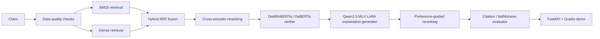

# Veritas | Trainable Evidence Retrieval, Cross-Encoder Ranking & Neural Fact Verification

Veritas is a Mac-first research system for evidence-grounded fact verification.
It combines trainable retrieval, cross-encoder reranking, transformer-based verdict prediction,
and citation-grounded explanation generation in a single reproducible workflow.

The design intentionally separates two jobs:

- verdict prediction, which is handled by a compact transformer verifier
- explanation generation, which is handled by Qwen2.5 MLX LoRA and preference-guided reranking (optional)

The verifier is the source of truth for the final label. The explanation model is not allowed to replace it.

## Why It Exists

Veritas is built to answer a practical research question: how far can a fully local, Mac-compatible
verification stack go without relying on CUDA, Colab, Kaggle, or bitsandbytes?

The measured bottleneck is **evidence retrieval and ranking**: the verifier performs well when
given gold (oracle) evidence (0.710 macro-F1) but drops sharply on retrieved evidence
(0.414 macro-F1). The project's focus is closing that oracle-vs-retrieved gap through a
fine-tuned bi-encoder retriever, a fine-tuned cross-encoder reranker, and a verifier trained to be
robust to retrieval noise.

The answer here is not "perfect" or "SOTA." It is a measured, honest stack with real retrieval, ranking, verifier, faithfulness, and latency tradeoffs.

## Key Results

All numbers below are measured on checked-in sample-scale evaluation runs.

| Component | Result |
| --- | --- |
| Verifier dataset | 2808 train / 649 val / 642 test (cross-split duplicate claim/evidence/label triples removed; see `reports/verifier_data_audit.md`) |
| Sklearn verifier | 0.484 accuracy, 0.482 macro-F1 |
| DistilRoBERTa verifier* | 0.718 accuracy, 0.711 macro-F1 |
| DistilRoBERTa REFUTED recall* | 0.745 |
| Oracle evidence verifier | 0.717 accuracy, 0.710 macro-F1 |
| End-to-end verifier with retrieved evidence | 0.440 accuracy, 0.414 macro-F1 |
| Top-k retrieved verifier (BM25 top-5) | 0.460 accuracy, 0.454 macro-F1 |
| Retrieval ablation (MiniLM, val split) | 0.558 recall@10, above BM25 at 0.461 |
| Dense retrieval | 0.357 recall@1, 0.524 recall@10 |
| Hybrid retrieval | 0.535 recall@10 |
| Cross-encoder ranking | 0.540 MAP, 0.562 MRR, 0.565 nDCG@10 |
| Template faithfulness | 0.560 citation validity, 0.755 verdict consistency |
| MLX LoRA explanation adapter | 0.695 verdict accuracy, 0.4632 macro-F1, 0.600 citation validity |
| DeBERTa challenger (xsmall) | 0.636 accuracy, 0.537 macro-F1, 0.036 refuted recall (macro-F1 below 0.55 threshold; REFUTED recall still low) |
| Final audit package | Oracle, retrieved, top-k, retrieval ablation, faithfulness, and Pareto summaries |
| Tests | 74 passed |

The most important signal is the oracle-vs-retrieved gap: retrieval quality still limits end-to-end verifier performance.

\* These rows were measured on the verifier dataset before the cross-split dedup above (2809/650/650). They are stale pending a retrain on the deduped 2808/649/642 split; the sklearn and DeBERTa rows have already been re-measured on the deduped split. The earlier DeBERTa run was also degenerate due to a separate bug: `microsoft/deberta-v3-xsmall` loads in fp16 by default on this transformers version, and training fp16 on CPU produced NaN gradients (`grad_norm: nan`, all predictions collapsed to SUPPORTED). Fixed by passing `dtype=torch.float32` in `_load_transformer()` in `scripts/train_transformer_verifier_clean.py`.

## Architecture



## What Is Implemented

- Reproducible FEVER and SciFact preprocessing
- Large and small sample pipelines for retrieval and verifier evaluation
- BM25, dense retrieval, hybrid reciprocal-rank fusion, and cross-encoder reranking
- DistilRoBERTa verifier with lightweight sklearn fallback
- DeBERTa challenger path for comparison and future selection
- DeBERTa challenger training and evaluation path with a measurable checkpoint
- Qwen2.5 MLX LoRA explanation generation on Apple Silicon
- Preference-guided explanation reranking as the Mac-compatible alternative to DPO
- Citation checking, faithfulness scoring, and explanation diagnostics
- Final evaluation suite and research audit packaging
- FastAPI service with response caching, fallback metadata, and health/metrics endpoints
- Gradio demo with a polished research-facing layout

## Live Demo

Public demo: [https://sushildalavi-veritas.hf.space](https://sushildalavi-veritas.hf.space)

The demo exposes:

- verdict
- confidence
- evidence
- citation validity
- retrieval backend
- reranker backend
- verifier backend
- fallback status
- latency

## Run Locally

```bash
make test
make lint
make demo
```

Optional API server:

```bash
make serve
```

## Research Workflow

Veritas is designed around a simple local research loop:

1. check dataset and evidence quality
2. retrieve candidate evidence
3. rerank the evidence
4. predict the verdict with the transformer verifier
5. generate an explanation conditioned on that verdict
6. validate citations and unsupported statements
7. compare metrics across retrieval, ranking, verifier, and explanation variants

That separation matters:

- the small language model should not be the verdict classifier
- explanation faithfulness should be evaluated separately from label accuracy
- retrieval quality should be measured independently from verifier quality

## Research Mode vs Live Mode

Live mode:

- BM25-first retrieval
- transformer verifier or sklearn fallback
- CPU-friendly
- minimal dependencies

Research mode:

- dense retrieval with sentence transformers
- hybrid fusion
- cross-encoder reranking
- MLX LoRA explanation generation
- preference-guided reranking
- deeper evaluation and ablation coverage

## Limitations

- The evaluation sets are sample-scale, not the full FEVER benchmark.
- End-to-end performance is materially worse than oracle evidence performance.
- Feeding top-5 retrieved evidence improves end-to-end macro-F1 to 0.454, but the oracle gap is still material.
- Citation faithfulness is measured, not assumed.
- The MLX LoRA explanation adapter is a small-sample result, not a benchmark claim.
- Preference-guided reranking is a deterministic Mac-compatible replacement for DPO, not DPO itself.
- CUDA QLoRA, CUDA DPO, Colab, and Kaggle are not part of the final project direction.

## Do Not Overclaim

- Do not call the project SOTA.
- Do not claim production-scale benchmark coverage.
- Do not claim perfect faithfulness.
- Do not describe preference reranking as DPO.
- Do not describe the MLX adapter as QLoRA.
- Do not hide the oracle-vs-retrieved gap.

## Resume-Safe Summary

Veritas is a Mac-compatible research and production ML project for evidence-grounded fact verification, with hybrid retrieval, transformer verdict classification, MLX LoRA explanation generation, and preference-guided explanation reranking.
