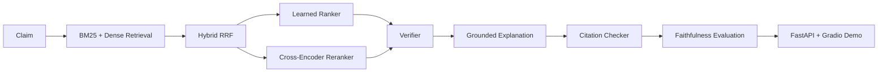

# Veritas

Veritas | Fact Verification with Neural Retrieval, Cross-Encoder Ranking, Fine-Tuned Transformer Verification, MLX LoRA & Citation Faithfulness

Veritas is a reproducible factual claim verification project.
It takes a claim through evidence retrieval, evidence ranking, claim verification, grounded explanation, citation validation, and faithfulness evaluation, then serves the system through FastAPI and Gradio.

## Results

These numbers come from the checked-in reports under `reports/`. The retrieval, ranking, and verifier numbers below are from larger (200-650 example) evaluation runs and are the current source of truth; the original tiny smoke-test numbers further down in this file are kept only for historical context.

| Component | Metric | Value | Report |
| --- | --- | ---: | --- |
| Data quality | sampled records (large pipeline) | 4109 | `reports/data_quality_large.md` |
| Verifier dataset | train / val / test examples | 2809 / 650 / 650 | `reports/verifier_data_audit.md` |
| Verifier (sklearn TF-IDF/LogReg) | test accuracy / macro F1 | 0.486 / 0.484 | `reports/verifier_clean_baseline.md` |
| Verifier (DistilRoBERTa, class-weighted) | test accuracy / macro F1 | 0.718 / 0.711 | `reports/transformer_verifier_clean_eval.md` |
| Verifier (DistilRoBERTa) | REFUTED recall | 0.745 | `reports/transformer_verifier_clean_eval.md` |
| Oracle vs. retrieved | oracle accuracy / macro F1 | 0.717 / 0.710 | `reports/oracle_verifier_eval.md` |
| Oracle vs. retrieved | end-to-end (BM25 top-1) accuracy / macro F1 | 0.440 / 0.414 | `reports/end_to_end_verifier_eval.md` |
| Neural retrieval (200 queries) | dense backend | `sentence-transformers/all-MiniLM-L6-v2` | `reports/retrieval_eval_neural_large.md` |
| Neural retrieval (200 queries) | dense recall@1 / recall@10 | 0.357 / 0.524 | `reports/retrieval_eval_neural_large.md` |
| Neural retrieval (200 queries) | hybrid (RRF) recall@10 | 0.535 | `reports/retrieval_eval_neural_large.md` |
| Cross-encoder ranking (200 queries) | cross-encoder model | `cross-encoder/ms-marco-MiniLM-L-6-v2` | `reports/ranking_eval_cross_encoder_large.md` |
| Cross-encoder ranking (200 queries) | MAP / MRR / nDCG@10 | 0.540 / 0.562 / 0.565 | `reports/ranking_eval_cross_encoder_large.md` |
| Faithfulness (template, 200 val examples) | citation validity rate | 0.560 | `reports/faithfulness_comparison.md` |
| Faithfulness (template, 200 val examples) | verdict consistency rate | 0.755 | `reports/faithfulness_comparison.md` |
| Pareto (measured) | best frontier (quality) | `distilroberta-clean`, macro F1 0.711 | `reports/final_pareto_analysis.md` |
| Pareto (measured) | best frontier (deployment cost) | `sklearn-tfidf-logreg`, macro F1 0.484, 0.6MB | `reports/final_pareto_analysis.md` |
| MLX LoRA (Apple Silicon, `Qwen2.5-1.5B-Instruct-4bit`) | verdict accuracy / macro F1 / citation valid rate (20 examples) | 0.6 / 0.4 / 0.5 | `reports/mlx_lora_eval.md`, `reports/mlx_lora_READY.md` |
| CUDA QLoRA / DPO | status | **not trained - optional cloud path / no DPO trainer** | `reports/qlora_BLOCKED_GPU_REQUIRED.md`, `reports/dpo_BLOCKED_QLORA_REQUIRED.md`, `reports/mlx_dpo_READY.md` |
| Tests | pytest suite | 73 passed | - |

## Architecture



## What Is Implemented

- Sampled FEVER and SciFact processing into reproducible JSONL artifacts.
- A larger FEVER + SciFact sample pipeline under `data/processed/*_large.jsonl` for more realistic local evaluation.
- Deterministic hashing dense retrieval for CI and a real `sentence-transformers` dense path for local neural evaluation.
- BM25, hybrid RRF, heuristic ranking, learned ranking, and optional cross-encoder reranking.
- Lightweight sklearn verifier checkpoint plus a real transformer fine-tuning path.
- Citation checking and faithfulness evaluation.
- FastAPI API and Gradio demo with caching, validation, monitoring, and fallback metadata.
- Artifact manifest generation for reports and checkpoints.

## Reproduce

```bash
make build-sample-data
make build-large-sample-data
make eval-retrieval
make eval-ranking
make eval-retrieval-large
make eval-ranking-large
make train-verifier
make eval-faithfulness
make error-analysis
make pareto-analysis
make manifest
make verify-local
```

To reproduce the Apple Silicon MLX LoRA alignment run (no CUDA, no
bitsandbytes):

```bash
make build-mlx-lora-data
make train-mlx-lora
make eval-mlx-lora
```

To reproduce the neural benchmark runs that exist in this repo:

```bash
python3 scripts/run_retrieval_eval.py \
  --split val \
  --max-queries 5 \
  --dense-backend sentence-transformers \
  --embedding-model sentence-transformers/all-MiniLM-L6-v2 \
  --output-json reports/retrieval_eval_neural.json \
  --output-md reports/retrieval_eval_neural.md

python3 scripts/run_ranking_eval.py \
  --split val \
  --max-queries 2 \
  --use-cross-encoder \
  --cross-encoder-model cross-encoder/ms-marco-MiniLM-L-6-v2 \
  --output-json reports/ranking_eval_cross_encoder.json \
  --output-md reports/ranking_eval_cross_encoder.md

python3 scripts/train_transformer_verifier.py \
  --model-name distilroberta-base \
  --max-train-examples 8 \
  --max-val-examples 4 \
  --max-test-examples 4 \
  --epochs 1 \
  --batch-size 2 \
  --output-dir checkpoints/transformer_verifier \
  --report-json reports/transformer_verifier_eval.json \
  --report-md reports/transformer_verifier_eval.md
```

## Run The Demo

Local Gradio demo:

```bash
python3 app.py
```

Optional service endpoints:

- `GET /health`
- `POST /verify`
- `GET /metrics`

If you want the API directly:

```bash
uvicorn serving.api:app --host 0.0.0.0 --port 8000
```

## Deploy To Hugging Face Spaces

Public demo URL: https://sushildalavi-veritas.hf.space

See [`DEPLOYMENT.md`](DEPLOYMENT.md) for the full step-by-step Space setup.

Short version:

1. Create a new Space.
1. Choose `Gradio` as the SDK.
1. Set Python to `3.11`.
1. Connect this repository or upload the files.
1. Verify that `app.py` launches and the UI shows verdict, confidence, evidence, citation status, backend, fallback status, and latency.

Deployment note:
- By default the serving stack resolves to the clean, class-weighted DistilRoBERTa verifier checkpoint in `checkpoints/transformer_verifier_clean/` (test accuracy 0.718, macro F1 0.711). If that checkpoint is absent it falls back to the sklearn TF-IDF/LogReg checkpoint in `checkpoints/verifier_clean/`, then to a mock verifier. See [`DEPLOYMENT.md`](DEPLOYMENT.md) for the lightweight vs. advanced serving-mode configs.
- `GET /health`, `POST /verify`, and `GET /metrics` report `model_name`, `checkpoint_path`, `verifier_macro_f1`, `retrieval_backend`, and `reranker_backend` so the active configuration can be confirmed at runtime.
- Cross-encoder reranking and dense/hybrid retrieval are optional and config-driven (`configs/serving_advanced.yaml`); the serving stack reports whether the requested model loaded or fell back.
- The deployment metadata in each checkpoint's `metadata.json` captures the library version, Python version, timestamp, git commit hash, training command, and sample sizes used to build the checkpoint.
- The larger sample pipeline is also reproducible from `make build-large-sample-data`; SciFact is capped by the size of the shipped corpus, while FEVER uses the requested larger split sizes.

## Production Features

- Central YAML + environment configuration in `core/config.py`.
- Artifact manifest generation in `reports/artifact_manifest.json`.
- Response caching with TTL.
- Health and metrics endpoints.
- Backend metadata in API responses.
- Fallback verifier and retrieval paths for CPU-only demo use.
- Validated request schema with claim stripping and length limits.
- Model checkpoint routing that prefers transformer checkpoints, then sklearn, then mock fallback.

## Limitations

- The FEVER/SciFact splits used for training and evaluation (2809/650/650) are sample-scale, not the full FEVER dataset; retrieval/ranking evals use a 9,804-passage corpus and 200-query samples.
- The clean DistilRoBERTa verifier (macro F1 0.711 on oracle/gold evidence) drops to macro F1 0.414 when fed real BM25 top-1 retrieved evidence (`reports/end_to_end_verifier_eval.md`) — the oracle/retrieved gap is real and should not be hidden.
- Template-based explanations are citation-valid 56% of the time on a 200-example validation sample (`reports/faithfulness_comparison.md`); this is the only explanation generator with measured numbers.
- **The MLX LoRA adapter (Apple Silicon, `checkpoints/mlx_lora_verifier/`) was trained on a small sample**: 600 training examples, 100 iterations, evaluated on 20 held-out examples (verdict accuracy 0.6, macro F1 0.4, citation valid rate 0.5; `reports/mlx_lora_eval.md`). This is a small-sample signal, not a benchmark result.
- **CUDA QLoRA fine-tuning was not executed** (optional cloud path only): this machine has no CUDA GPU and no `bitsandbytes`, so no `qlora_eval` reports exist. Ready-to-run scripts/configs are checked in (`scripts/train_qlora_real.py`, `configs/qlora_tinyllama.yaml`) along with `reports/qlora_BLOCKED_GPU_REQUIRED.md`.
- **DPO alignment (Phase 7) was not executed on either path.** The CUDA path depends on QLoRA (`reports/dpo_BLOCKED_QLORA_REQUIRED.md`); the installed `mlx-lm` (0.31.3) has no DPO trainer (`reports/mlx_dpo_READY.md`).
- The public Spaces URL is [https://sushildalavi-veritas.hf.space](https://sushildalavi-veritas.hf.space).

## What Not To Overclaim

- Do not claim broad production accuracy from the sample reports; numbers are from 200-650 example evaluation sets.
- Do not claim the public demo is deployed unless you are pointing to the live URL at `https://sushildalavi-veritas.hf.space`.
- **Do not claim CUDA QLoRA or DPO were trained** — no adapter checkpoints or `qlora_eval`/`dpo_eval`/`mlx_dpo_eval` reports exist. See `reports/qlora_BLOCKED_GPU_REQUIRED.md`, `reports/dpo_BLOCKED_QLORA_REQUIRED.md`, and `reports/mlx_dpo_READY.md`.
- **Do not call the MLX LoRA run "QLoRA"** — the adapter (`checkpoints/mlx_lora_verifier/`) is a standard LoRA adapter trained with `mlx_lm.lora --fine-tune-type lora` on a pre-quantized `mlx-community` base model; no quantized-LoRA training was performed. Do not overstate the small-sample metrics in `reports/mlx_lora_eval.md` (20-example eval) as benchmark-grade.
- Do not claim the verifier performs equally well end-to-end as it does on oracle/gold evidence; report both numbers (`reports/oracle_verifier_eval.md` vs. `reports/end_to_end_verifier_eval.md`).
- Do not claim citation faithfulness above the measured template-generator rate (56% citation-valid on the 200-example sample in `reports/faithfulness_comparison.md`).
- See `reports/final_completion_gate.md` for the authoritative completion status.

## Resume Bullets

- Built a reproducible FEVER/SciFact verification pipeline with checked-in sample datasets, artifact manifests, and real evaluation reports.
- Added optional sentence-transformer dense retrieval, cross-encoder reranking, and transformer verifier fine-tuning paths alongside lightweight CPU fallbacks.
- Hardened the serving stack with config-driven checkpoint routing, caching, health/metrics endpoints, and Gradio/FastAPI deployment readiness.
