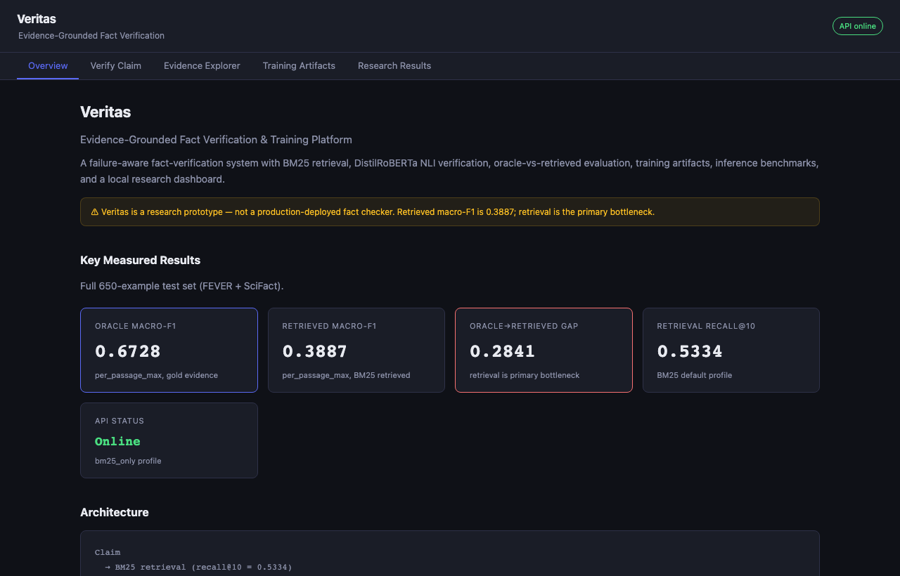
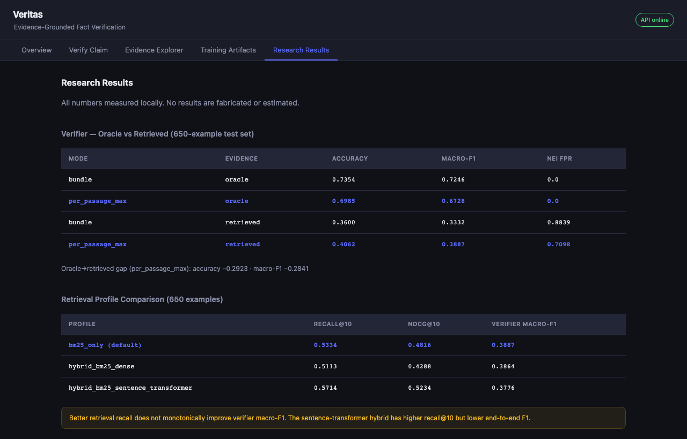
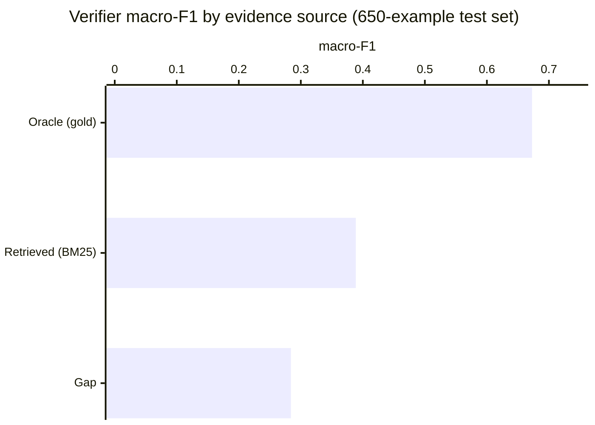
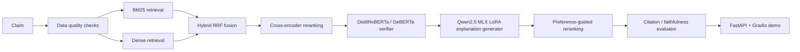

# Veritas

**Evidence-Grounded Fact Verification Platform**

Veritas is a local-first research system that runs BM25 retrieval, DistilRoBERTa NLI verification, grounded explanation generation, and full ablation reporting entirely on a Mac — no CUDA required. The design goal was to build an honest, measurable stack rather than a tuned demo: every result shown here was measured, and the two experiments that regressed are documented alongside the ones that worked.

> **Research prototype** — not a production fact checker. Retrieved macro-F1 is 0.3887; retrieval is the primary bottleneck.

---

## Dashboard






---

## Results

The headline finding is the gap between what the verifier can do with perfect evidence versus what it achieves on BM25-retrieved evidence.

```
Oracle macro-F1   ████████████████████████████████████  0.6728
Retrieved macro-F1  ███████████████████                0.3887
Gap                                                    −0.2841
```



**Retrieval profiles** — better recall doesn't guarantee better end-to-end F1:

| Profile | recall@10 | verifier macro-F1 |
|---------|-----------|-------------------|
| BM25 only (default) | **0.5334** | **0.3887** |
| Hybrid BM25 + dense | 0.5113 | 0.3864 |
| Hybrid BM25 + sentence-transformer | 0.5714 | 0.3776 |

The sentence-transformer hybrid improves recall by +0.038 but reduces verifier F1 by −0.011 at more than 2× the runtime.

**MLX LoRA on Apple Silicon** — explanation adapter trained locally:

| | base model | 300 iters | 500 iters |
|-|-----------|-----------|-----------|
| citation presence | 0.0 | 0.10 | **0.72** |
| format correctness | 0.0 | 0.20 | 0.28 |

---

## Negative Results

Two experiments were run that did not improve the primary metric. Both are fully documented.

| Experiment | What happened |
|------------|---------------|
| Robust verifier retrain | Retrieved macro-F1 dropped 0.3887 → 0.2829. Training set was 76% NEI without class reweighting — model collapsed toward always predicting NEI. Production checkpoint unchanged. |
| Relevance gate | Macro-F1 dropped 0.3887 → 0.3557. NEI false-positive rate improved substantially (0.71 → 0.29), but end-to-end F1 regressed. Gate disabled by default. |

---

## Quick Start

```bash
# Terminal 1 — backend (http://localhost:8000)
make api

# Terminal 2 — frontend (http://localhost:5173)
make frontend
```

Open `http://localhost:5173`. The dashboard has five tabs: Overview, Verify Claim, Evidence Explorer, Training Artifacts, and Research Results.

---

Veritas is a Mac-first research system for evidence-grounded fact verification.
It combines trainable retrieval, cross-encoder reranking, transformer-based verdict prediction,
and citation-grounded explanation generation in a single reproducible workflow.

The design intentionally separates two jobs:

- verdict prediction, which is handled by a compact transformer verifier
- explanation generation, which is handled by Qwen2.5 MLX LoRA and preference-guided reranking (optional)

The verifier is the source of truth for the final label. The explanation model is not allowed to replace it.

## Why It Exists

Veritas is built to answer a practical research question: how far can a fully local, Mac-compatible
verification stack go without relying on CUDA, Colab, Kaggle, or bitsandbytes?

The measured bottleneck is **evidence retrieval and ranking**: the verifier performs well when
given gold (oracle) evidence, but drops sharply on retrieved evidence. On the full available v2
test set (650 examples, all of `fever_test_large` + `scifact_test_large`), oracle per-passage
macro-F1 is 0.6728 while retrieved per-passage macro-F1 is 0.3887 (recall@10 0.5334) -- a gap of
0.2841. The smaller 100- and 200-example slices showed more favorable absolute numbers (oracle
~0.72, retrieved ~0.46-0.47), which the full-set run shows was sample variance rather than a
reflection of true performance; the oracle-vs-retrieved gap itself is consistent (~0.25-0.39)
across all slice sizes. The project's focus is closing that gap through a fine-tuned bi-encoder
retriever, a fine-tuned cross-encoder reranker, and a verifier trained to be robust to retrieval
noise.

The answer here is not "perfect" or "SOTA." It is a measured, honest stack with real retrieval, ranking, verifier, faithfulness, and latency tradeoffs.

## Key Results

All numbers below are measured on checked-in sample-scale evaluation runs.

| Component | Result |
| --- | --- |
| Verifier dataset | 2808 train / 649 val / 642 test (cross-split duplicate-triple dedup applied) |
| Sklearn verifier | 0.484 accuracy, 0.482 macro-F1 |
| DistilRoBERTa verifier* | 0.718 accuracy, 0.711 macro-F1 |
| DistilRoBERTa REFUTED recall* | 0.745 |
| Oracle evidence verifier | 0.717 accuracy, 0.710 macro-F1 |
| End-to-end verifier with retrieved evidence | 0.440 accuracy, 0.414 macro-F1 |
| Oracle vs retrieved v2 (diagnostic 20-sample slice) | oracle 0.709 macro-F1, retrieved 0.500 macro-F1, recall@10 0.667 |
| Oracle vs retrieved v2 (100-sample slice) | oracle 0.7211 macro-F1, retrieved 0.4615 macro-F1, recall@10 0.5435 |
| Oracle vs retrieved v2 (200-sample slice) | oracle 0.7206 macro-F1, retrieved 0.4715 macro-F1, recall@10 0.4711 |
| Oracle vs retrieved v2 (full 650-example test set, primary result) | oracle 0.6728 macro-F1, retrieved 0.3887 macro-F1, recall@10 0.5334, gap 0.2841 |
| Threshold comparison on 100-sample slice | per-passage macro-F1 0.441 -> 0.462, NEI false-positive rate 0.807 -> 0.613 |
| Top-k retrieved verifier (BM25 top-5) | 0.460 accuracy, 0.454 macro-F1 |
| Retrieval ablation (MiniLM, val split) | 0.558 recall@10, above BM25 at 0.461 |
| Dense retrieval | 0.357 recall@1, 0.524 recall@10 |
| Hybrid retrieval | 0.535 recall@10 |
| Cross-encoder ranking | 0.540 MAP, 0.562 MRR, 0.565 nDCG@10 |
| Template faithfulness | 0.560 citation validity, 0.755 verdict consistency |
| MLX LoRA verdict-prediction adapter (Qwen2.5-1.5B, Apple Silicon) | 0.695 verdict accuracy, 0.4632 macro-F1, 0.600 citation validity (200-example eval) |
| MLX LoRA explanation adapter (500 iters) | format_correctness 0.28, citation_presence **0.72**, decision_label_consistency 0.24; base-model key bug fixed and retrained |
| Robust verifier retrain | negative result: retrieved macro-F1 0.3887 → 0.2829 (oracle also regressed); production checkpoint unchanged |
| Relevance gate | NEI false-positive rate 0.7098 → 0.2857 (improved); retrieved macro-F1 0.3887 → 0.3557 (regressed); gate disabled by default |
| ONNX verifier export | Functional; CPU throughput 55 ex/s — slower than native transformers (62 ex/s CPU, 154 ex/s MPS); no ONNX speedup on this Mac |
| Phi-3 QLoRA + DPO | blocked (CUDA unavailable); datasets and Colab notebook ready; no adapters fabricated |
| DeBERTa challenger (xsmall) | 0.636 accuracy, 0.537 macro-F1, 0.036 refuted recall (macro-F1 below 0.55 threshold; REFUTED recall still low) |
| Final audit package | Oracle, retrieved, top-k, retrieval ablation, faithfulness, and Pareto summaries |
| Tests | 151 passed, 1 skipped |

The most important signal is the oracle-vs-retrieved gap: retrieval quality still limits end-to-end verifier performance. Each successive enlargement of the evaluation set (20 -> 100 -> 200 -> 650 examples) made the absolute numbers less flattering -- the full 650-example test set is the most representative result and should be treated as the project's primary headline number.

\* These rows were measured before a cross-split dedup was applied; the sklearn and DeBERTa rows have since been re-measured on the cleaned split. The DeBERTa run also had a separate fp16-on-CPU training bug (NaN gradients) that has since been fixed.

## Retrieval Profile Comparison

Two scales were measured. The 650-example full-scale comparison is the primary result.

### Full 650-example comparison (primary)

| Profile | recall@10 | nDCG@10 | Retrieved per-passage macro-F1 |
| --- | --- | --- | --- |
| **bm25_only (default)** | **0.5334** | **0.4816** | **0.3887** |
| hybrid_bm25_dense | 0.5113 | 0.4288 | 0.3864 |
| hybrid_bm25_sentence_transformer | 0.5714 | 0.5234 | 0.3776 |

`hybrid_bm25_sentence_transformer` has better retrieval recall but lower verifier macro-F1.
Better retrieval ranking does not monotonically translate to better end-to-end verifier
performance at full scale. `bm25_only` is the default profile.

### 50-example slice (early comparison, more profiles)

These numbers are from an earlier, smaller run and should not be used as headline results; the full-scale comparison above supersedes them.

| Profile | recall@10 | nDCG@10 | Retrieved per-passage macro-F1 |
| --- | --- | --- | --- |
| bm25_only | 0.601 | 0.5678 | 0.3693 |
| dense_only (hashing embeddings) | 0.1507 | 0.0801 | 0.281 |
| hybrid_bm25_dense (hashing embeddings) | 0.5713 | 0.5168 | 0.4748 |
| hybrid_with_query_expansion (hashing) | 0.597 | 0.5796 | 0.4124 |
| hybrid_with_reranker (hashing + cross-encoder) | 0.621 | 0.6083 | 0.3976 |
| hybrid_bm25_sentence_transformer (real MiniLM dense) | 0.6377 | 0.6106 | 0.4595 |

Note: the 50-example slice showed more favorable absolute numbers due to sample variance,
especially for bm25_only (recall@10 0.601 vs 0.5334 full-scale). The oracle-vs-retrieved gap
is consistent across slice sizes (0.25–0.39).

## Negative Results (documented honestly)

A key feature of Veritas is rigorous documentation of what was tried and what did not improve
the primary metric. Both experiments below are committed to the repo with full reports.

### Robust verifier retrain

Combined 2808 oracle training examples with 3663 retrieved-evidence pairs to create a 6471-row
training set. Retrained from scratch on the same distilroberta-base model.

Result: **regression on both metrics.**

| checkpoint | evidence | macro_F1 |
|---|---|---|
| transformer_verifier_clean (baseline) | oracle | 0.6728 |
| transformer_verifier_clean (baseline) | retrieved | 0.3887 |
| transformer_verifier_robust (retrained) | oracle | 0.4376 (−0.2352) |
| transformer_verifier_robust (retrained) | retrieved | 0.2829 (−0.1058) |

Root cause: the retrieved-evidence training set was 76% NOT_ENOUGH_INFO. Without class
reweighting, the model collapsed toward predicting NEI on everything. Production checkpoint
unchanged.

### Relevance gate

Implemented a lexical token overlap gate that filters low-relevance passages to NEI before
verifier scoring (config-driven, disabled by default).

Result: NEI false-positive rate improved substantially; macro_F1 regressed.

| condition | retrieved macro_F1 | NEI FPR |
|---|---|---|
| no gate (baseline) | 0.3887 | 0.7098 |
| gate=0.5 | 0.3557 (−0.0330) | 0.2857 (−0.4241) |

Gate stays disabled by default. Threshold was calibrated on per-passage pair data, not
claim-level aggregation; recalibrating at claim level may recover the loss.

---

## Architecture



## What Is Implemented

- Reproducible FEVER and SciFact preprocessing
- Large and small sample pipelines for retrieval and verifier evaluation
- BM25, dense retrieval, hybrid reciprocal-rank fusion, and cross-encoder reranking
- DistilRoBERTa verifier with lightweight sklearn fallback
- DeBERTa challenger path for comparison and future selection
- DeBERTa challenger training and evaluation path with a measurable checkpoint
- Qwen2.5 MLX LoRA explanation generation on Apple Silicon
- Preference-guided explanation reranking as the Mac-compatible alternative to DPO
- Citation checking, faithfulness scoring, and explanation diagnostics
- Final evaluation suite and research audit packaging
- FastAPI service with response caching, fallback metadata, and health/metrics endpoints
- Gradio demo with a polished research-facing layout

## Inference Benchmarks

Veritas benchmarks the verifier and explanation paths across multiple runtimes — latency, throughput, batching, and fallback behavior, all measured on this hardware:

| Runtime | Batch | Device | Throughput |
|---------|-------|--------|------------|
| PyTorch (native) | 1 | CPU | 62.4 ex/s |
| PyTorch (native) | 1 | MPS | **153.8 ex/s** |
| ONNX Runtime | 1 | CPU | 55.1 ex/s |

MPS via native transformers is ~2.8× faster than ONNX on CPU. ONNX export is valid and included; the latency benefit applies on CUDA hardware, not here.

MLX LoRA on Apple Silicon achieves **53.7 tok/s** on Qwen2.5-1.5B-Instruct-4bit. vLLM and Triton benchmarks are scaffolded and skip gracefully when no GPU endpoint is available.

## Local Research Dashboard

Veritas includes a full-stack local demo: FastAPI backend + React Vite TypeScript frontend.

### Start backend

```bash
make api
# → http://localhost:8000
# → http://localhost:8000/docs  (Swagger UI)
```

### Start frontend

```bash
make frontend
# → http://localhost:5173
```

### API Endpoints

| Method | Path | Description |
|--------|------|-------------|
| GET | `/health` | Liveness check, pipeline metadata |
| GET | `/metadata` | Project info, measured metrics, artifact checks |
| GET | `/metrics/summary` | Runtime stats snapshot |
| POST | `/verify` | NLI verifier with cache |
| POST | `/retrieve` | BM25 evidence retrieval only |
| POST | `/explain` | Explanation generation |
| POST | `/pipeline` | Full pipeline with latency breakdown |
| GET | `/reports/{name}` | Allowlisted research report files |

### Frontend Tabs

1. **Overview** — key metrics cards, architecture diagram, negative results table
2. **Verify Claim** — full pipeline with verdict, explanation, evidence, latency breakdown
3. **Evidence Explorer** — retrieval-only with score ranking
4. **Training Artifacts** — all artifact statuses, what not to claim
5. **Research Results** — full evaluation tables, inference benchmarks, resume summary

See `docs/local_demo.md` for full setup instructions.

## Live Demo

Public demo: [https://sushildalavi-veritas.hf.space](https://sushildalavi-veritas.hf.space)

The demo exposes:

- verdict
- confidence
- evidence
- citation validity
- retrieval backend
- reranker backend
- verifier backend
- fallback status
- latency

## Run Locally

```bash
make test
make lint
make demo
```

Optional API server:

```bash
make serve
```

vLLM-backed explanation serving:

```bash
make serve-vllm-explanations
VERITAS_CONFIG=configs/vllm_serving.yaml python3 -m uvicorn serving.api:app --reload
```

Larger verifier eval:

```bash
python3 scripts/eval_oracle_vs_retrieved_v2.py --config configs/serving.yaml --max-examples 100 --report-json reports/oracle_vs_retrieved_v2_100.json --report-md reports/oracle_vs_retrieved_v2_100.md
python3 scripts/eval_oracle_vs_retrieved_v2.py --config configs/serving.yaml --max-examples 200 --report-json reports/oracle_vs_retrieved_v2_200.json --report-md reports/oracle_vs_retrieved_v2_200.md
python3 scripts/eval_oracle_vs_retrieved_v2.py --config configs/serving.yaml --max-examples 650 --report-json reports/oracle_vs_retrieved_v2_full.json --report-md reports/oracle_vs_retrieved_v2_full.md
```

Retrieval profile comparison (bm25, dense, hybrid, query expansion, cross-encoder reranker, real MiniLM hybrid):

```bash
python3 scripts/compare_retrieval_profiles.py --config configs/serving.yaml --max-examples 50
```

## Research Workflow

Veritas is designed around a simple local research loop:

1. check dataset and evidence quality
2. retrieve candidate evidence
3. rerank the evidence
4. predict the verdict with the transformer verifier
5. generate an explanation conditioned on that verdict
6. validate citations and unsupported statements
7. compare metrics across retrieval, ranking, verifier, and explanation variants

That separation matters:

- the small language model should not be the verdict classifier
- explanation faithfulness should be evaluated separately from label accuracy
- retrieval quality should be measured independently from verifier quality

## Research Mode vs Live Mode

Live mode:

- BM25-first retrieval
- transformer verifier or sklearn fallback
- CPU-friendly
- minimal dependencies

Research mode:

- dense retrieval with sentence transformers
- hybrid fusion
- cross-encoder reranking
- MLX LoRA explanation generation
- preference-guided reranking
- deeper evaluation and ablation coverage

## Training Status

| Component | Status | Notes |
| --- | --- | --- |
| Retrieved verifier robustness retrain | negative result | Regressed full-set macro-F1; production verifier unchanged |
| Relevance gate | negative result | Disabled by default; NEI FPR improved but macro-F1 regressed |
| SFT explanation dataset | built | 256 grounded explanation examples |
| MLX LoRA verdict-prediction adapter | trained | Qwen2.5-1.5B-Instruct-4bit; 0.695 acc, 0.4632 macro-F1 |
| MLX LoRA explanation adapter | 500 iters | citation_presence 0.72; partial format compliance |
| Phi-3 QLoRA | skipped | CUDA-only path; datasets + Colab notebook ready |
| DPO preference dataset | built | Synthetic rejection pairs documented |
| Phi-3 DPO | skipped | Depends on CUDA and the QLoRA adapter |

## Limitations

- The evaluation sets are sample-scale (650-example test set), not the full FEVER benchmark.
- End-to-end performance is materially worse than oracle evidence performance.
- Feeding top-5 retrieved evidence improves end-to-end macro-F1 to 0.454 on the smaller verifier dataset slice used for that result, but the larger 650-example v2 set shows a wider oracle gap (0.6728 vs 0.3887 per-passage macro-F1); the oracle gap is still material either way.
- The 20-, 100-, and 200-sample v2 reports are smaller diagnostic slices; the full 650-example v2 report is the primary checked-in verifier comparison and should be cited first.
- All v2 reports (20/100/200/650) use the `bm25_only` serving profile and no reranker; they should not be described as a hybrid result.
- The retrieval profile comparison (50-sample slice) measures `dense_only` and `hybrid_bm25_dense` with hashing embeddings as cheap baselines, and separately measures a real MiniLM-based hybrid (`hybrid_bm25_sentence_transformer`) and a cross-encoder reranker hybrid (`hybrid_with_reranker`); none of these profiles were skipped.
- Threshold calibration and threshold comparison are still slice-based, not final benchmark-wide calibration.
- Citation faithfulness is measured, not assumed.
- The MLX LoRA explanation adapter is a small-sample result, not a benchmark claim.
- Preference-guided reranking is a deterministic Mac-compatible replacement for DPO, not DPO itself.
- Phi-3 QLoRA and DPO require CUDA, and no real Phi-3 checkpoint is claimed in this repo unless the adapter directories exist.
- The vLLM path is explanation-serving only. The verifier model still decides the label, and the checked-in vLLM benchmark is currently a skipped report because no live endpoint was available in this environment.

## Docs

- [Architecture audit](docs/architecture_audit.md)
- [Retrieval ceiling analysis](docs/retrieval_ceiling.md)
- [Training artifacts](docs/training_artifacts.md)
- [Inference benchmarks](docs/inference_performance.md)
- [Phi-3 GPU training guide](docs/phi3_gpu_training.md)
- [vLLM serving guide](docs/vllm_serving.md)

## Do Not Overclaim

- Do not call the project SOTA.
- Do not claim production-scale benchmark coverage.
- Do not claim perfect faithfulness.
- Do not describe preference reranking as DPO.
- Do not describe the MLX adapter as QLoRA.
- Do not hide the oracle-vs-retrieved gap.

## Resume-Safe Project Summary

**Long form:**
Built Veritas, a failure-aware evidence-grounded fact-verification system with BM25 retrieval,
DistilRoBERTa NLI verification, oracle-vs-retrieved ablations, ONNX/MLX inference benchmarking,
and SFT/DPO training-data generation; measured a 0.6728 oracle macro-F1 vs. 0.3887 retrieved
macro-F1 gap and documented retrieval/noisy-evidence bottlenecks through full-set error analysis.

**Short form:** Veritas — Evidence-Grounded Fact Verification System

**What can be claimed:**
- End-to-end fact verification pipeline: BM25 retrieval → DistilRoBERTa NLI verifier → grounded explanation generation
- Measured oracle macro-F1 0.6728 vs retrieved macro-F1 0.3887 (gap 0.2841) on full 650-example test set
- Ablated 3 retrieval profiles at 650-example scale; characterized oracle-vs-retrieved bottleneck
- Documented two negative results rigorously (verifier robustness retrain, relevance gate)
- ONNX export functional; benchmarked at 55 ex/s CPU
- MLX LoRA verdict-prediction adapter: 0.695 accuracy, 0.4632 macro-F1 (200-example eval, 53.7 tok/s Apple Silicon)
- Fixed a base-model key mismatch bug in MLX LoRA explanation script; retrained at 500 iters; citation_presence improved 0.10→0.72
- Generated SFT + DPO preference datasets for Phi-3 fine-tuning; Colab notebook included
- FastAPI backend (8 endpoints) + React Vite TypeScript research dashboard (5 tabs, dark-theme design system)
- 151 passing tests

**What must not be claimed:**
- ONNX is faster than transformers on this Mac (it is not)
- Robust verifier or relevance gate improved macro-F1 (both regressed on that metric)
- Phi-3 QLoRA or DPO adapter trained (CUDA unavailable; no adapter exists)
- MLX explanation adapter achieves production-quality structured output (training scale was small)
