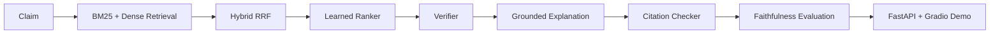

# Veritas

Veritas | LLM Fact Verification with Hybrid Retrieval, Learned Ranking, QLoRA, and DPO Alignment

Veritas is a reproducible factual claim verification project:
claim -> evidence retrieval -> evidence ranking -> claim verification -> grounded explanation -> citation and faithfulness evaluation -> deployment.

## Sample Run

The repository now includes real sample artifacts generated from FEVER and SciFact subsets. The numbers below come from the checked-in reports under `reports/`.

| Component | Metric | Value |
| --- | --- | ---: |
| Data quality | sampled records | 8 |
| Data quality | missing evidence spans | 1 |
| Data quality | average claim length | 8.0 |
| Retrieval | evidence corpus size | 12 |
| Retrieval | FEVER validation BM25 MRR | 1.000 |
| Ranking | learned ranker backend | `sklearn-logistic` |
| Ranking | FEVER train learned MAP | 0.750 |
| Verification | checkpoint path | `checkpoints/verifier/model.joblib` |
| Verification | train accuracy | 0.750 |
| Verification | validation accuracy | 0.400 |
| Verification | test accuracy | 0.333 |
| Faithfulness | citation validity rate | 0.875 |
| Faithfulness | verdict consistency rate | 0.875 |
| Error analysis | mismatch count | 6 |
| Error analysis | error rate | 0.750 |
| Pareto | best frontier point | `mock-top5` |
| Pareto | frontier macro-F1 | 0.302 |
| Pareto | frontier latency | 0.20 ms |

## Architecture



## Run the Pipeline

1. Build the sample datasets and quality reports:

```bash
make build-sample-data
```

2. Run retrieval and ranking benchmarks:

```bash
make eval-retrieval
make eval-ranking
```

3. Train the lightweight verifier checkpoint:

```bash
make train-verifier
```

4. Generate faithfulness, error, and Pareto analysis reports:

```bash
make eval-faithfulness
make error-analysis
make pareto-analysis
```

5. Generate the artifact manifest and run a local verification bundle:

```bash
make manifest
make verify-local
```

## Deployment

- Free public demo target: Hugging Face Spaces + Gradio
- Local Spaces-style entrypoint: `make demo`
- Local API: `make serve-real`
- Local UI: `make ui`
- Local CLI: `make cli`
- Export the demo corpus: `make export-demo-corpus`
- Docker deployment: `docker build -t veritas . && docker run -p 8000:8000 veritas`
- Environment variables:
  - `VERITAS_EVIDENCE_CORPUS=data/processed/evidence_corpus.jsonl`
  - `VERITAS_VERIFIER_CHECKPOINT=checkpoints/verifier`

## Service Endpoints

- `GET /health`
- `POST /verify`
- `GET /metrics`

## Makefile

- `make setup`: install Python dependencies
- `make test`: run the test suite
- `make lint`: run a lightweight compile check
- `make build-sample-data`: build the sampled FEVER and SciFact artifacts
- `make eval-retrieval`: run retrieval evaluation
- `make eval-ranking`: run ranking evaluation
- `make train-verifier`: train the lightweight verifier checkpoint
- `make train-verifier-smoke`: train into a temporary checkpoint path
- `make eval-faithfulness`: run the citation and faithfulness report
- `make error-analysis`: run verifier error analysis
- `make pareto-analysis`: run the quality-versus-cost Pareto report
- `make manifest`: write the artifact manifest
- `make all-evals`: run the full local evaluation bundle
- `make audit`: alias for `make manifest`
- `make verify-local`: run tests, lint, and manifest generation
- `make serve-real`: run the FastAPI app with the trained checkpoint when available
- `make demo`: launch the Spaces entrypoint

## Data Quality

- Exact deduplication is implemented for claims and evidence spans.
- Near-duplicate detection is exposed with a dependency-light fallback.
- Chunking is configurable by window size and overlap.
- Quality audits report label distribution, duplicate count, missing evidence count, and length statistics.

## Training

- `training/train_deberta.py` is the offline verifier fine-tuning entry point.
- `training/train_qlora.py` is the offline QLoRA path.
- `training/train_dpo.py` is the offline DPO alignment path.
- `training/train_ranker.py` is the learned ranker training entry point.
- These scripts stay lightweight in CI and do not download large models there.

## Evaluation

- Retrieval metrics live in `evaluation/retrieval_metrics.py`.
- Ranking metrics live in `evaluation/ranking_metrics.py`.
- Classification metrics live in `evaluation/classification_metrics.py`.
- Calibration and error analysis live in `evaluation/confidence_analysis.py` and `evaluation/error_analysis.py`.
- Faithfulness helpers live in `evaluation/faithfulness_metrics.py`.
- Pareto analysis helpers live in `evaluation/pareto_analysis.py`.

## Limitations

- The sampled benchmark is intentionally small, so the metrics are useful for regression tracking but not for claiming broad model quality.
- The free demo uses fallback components when checkpoints are unavailable.
- Offline QLoRA and DPO flows are not required for the CPU demo or CI.
- Retrieval corpora in the demo path are intentionally small and should be replaced with project data for any serious evaluation.

## Resume Bullets

- Built a reproducible FEVER/SciFact sampling pipeline with a 12-passage evidence corpus and generated quality reports from real JSONL artifacts.
- Trained a lightweight verifier checkpoint with 0.75 train accuracy, 0.40 validation accuracy, and 0.333 test accuracy, then wired serving to prefer the checkpoint automatically.
- Added retrieval, ranking, faithfulness, error-analysis, and Pareto reports backed by checked-in scripts and report artifacts.

## Notes

- No fake metrics are reported in this repository.
- If a table or bullet is not backed by a script run, it stays out of the README.
