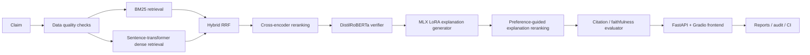

# Veritas Architecture

Veritas is a Mac-first neural fact verification system with two distinct responsibilities:

1. verdict classification, which must be accurate and reproducible
2. explanation generation, which must be faithful to the verifier verdict and evidence

## Core design

## Why verdicts and explanations are separated

Verdict prediction and explanation generation optimize different objectives.

- The verifier should be small, fast, and measurable.
- The explanation model should preserve the verifier verdict and cite evidence faithfully.
- Mixing both jobs into one small language model made the earlier CUDA/LLM experiments brittle and hard to evaluate.

The trained DistilRoBERTa verifier remains the source of truth for verdicts.

## Verifier

The production verifier is the clean DistilRoBERTa checkpoint:

- `checkpoints/transformer_verifier_clean/`
- test accuracy around `0.718`
- macro-F1 around `0.711`
- REFUTED recall around `0.745`

The sklearn verifier remains as a lightweight fallback:

- `checkpoints/verifier_clean/`
- used when the transformer checkpoint is unavailable

## Explanation generation

The explanation generator is Mac-local MLX LoRA:

- base model: `mlx-community/Qwen2.5-1.5B-Instruct-4bit`
- adapter: `checkpoints/mlx_lora_verifier`
- purpose: generate structured, citation-grounded explanations conditioned on the verifier verdict

This component is explanation-only. It is not the verdict source of truth.

## Why Mac preference reranking replaces DPO

Mac/local MLX tooling does not provide a robust, repo-native DPO trainer.
Rather than fake a DPO story, Veritas uses a deterministic preference-guided reranker:

- generate multiple explanation candidates
- score each candidate for JSON validity, verdict consistency, citation validity, unsupported sentence rate, and concision
- select the best candidate

This is cheaper, reproducible, and compatible with the Mac-only stack.

## Retrieval stack

Retrieval is layered and configurable:

- BM25 for deterministic lexical recall
- sentence-transformer dense retrieval for semantic recall
- hybrid reciprocal-rank fusion for stronger candidate coverage
- cross-encoder reranking for high-precision ordering when the model is available

The current live deployment can stay on the lightweight path while research mode uses the richer retrieval stack.

## Live vs. research mode

Live mode:

- CPU-safe
- fast cold start
- transformer verifier or sklearn fallback
- BM25-only retrieval by default
- no Mac-only MLX training dependency at runtime

Research mode:

- hybrid retrieval
- cross-encoder reranking
- MLX LoRA explanation generation
- explanation reranking
- richer evaluation reports and ablations

## Deployment rule

The public demo must not claim CUDA QLoRA or DPO.
Only the checked-in Mac-compatible verifier and retrieval stack are production claims.
