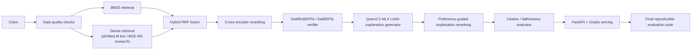

# Veritas Architecture

Veritas is a Mac-first factual claim verification system with two separate jobs:

1. classify the claim verdict as accurately as possible
2. generate faithful, citation-grounded explanations for that verdict

The verifier is the source of truth. The explanation model is not allowed to replace it.

## Final pipeline

## Verdict classification

The production verifier should stay small, measurable, and reproducible.

- Default best checkpoint: `checkpoints/transformer_verifier_clean/`
- Challenger checkpoint: `checkpoints/deberta_verifier_clean/`
- Lightweight fallback: `checkpoints/verifier_clean/`
- Last-resort fallback: deterministic mock verifier

The verdict classifier is the only component allowed to decide the final label.

## Explanation generation

The explanation model is Mac-local MLX LoRA on Qwen2.5.

- Base model: `mlx-community/Qwen2.5-1.5B-Instruct-4bit`
- Adapter: `checkpoints/mlx_lora_verifier/`
- Output: strict JSON with `verdict`, `explanation`, and `citations`

This component is explanation-only. It should condition on the verifier verdict, not predict the verdict independently.

## Preference-guided reranking

Mac-only tooling does not give a reliable repo-native DPO path, so Veritas uses deterministic preference-guided reranking instead.

The reranker scores each candidate explanation by:

- valid JSON
- verdict consistency with the verifier
- citation validity
- unsupported sentence rate
- concision

The highest-scoring candidate is selected. This is cheaper than DPO and easier to audit.

## Retrieval modes

Live mode:

- BM25 only, or BM25 plus all-MiniLM dense retrieval if enabled
- cross-encoder reranking optional
- CPU-safe and fast to start
- no dependency on CUDA, Colab, Kaggle, or bitsandbytes

Research mode:

- BM25
- sentence-transformer dense retrieval with `sentence-transformers/all-MiniLM-L6-v2`
- optional research dense retrieval with `BAAI/bge-m3`
- hybrid reciprocal-rank fusion
- cross-encoder reranking
- MLX LoRA explanations
- preference reranking

## Configuration

The serving stack is config-driven through `core/config.py` and YAML files under `configs/`.

Important keys:

- `retrieval_backend`: `bm25_only`, `sentence_transformer_hybrid`, or `bge_m3_hybrid`
- `embedding_model`: `sentence-transformers/all-MiniLM-L6-v2`
- `research_embedding_model`: `BAAI/bge-m3`
- `reranker_backend`: `none` or `cross_encoder`
- `cross_encoder_model`: `cross-encoder/ms-marco-MiniLM-L-6-v2`
- `verifier_checkpoint`: `checkpoints/transformer_verifier_clean`
- `challenger_verifier_checkpoint`: `checkpoints/deberta_verifier_clean`
- `mlx_lora_model`: `mlx-community/Qwen2.5-1.5B-Instruct-4bit`
- `mlx_lora_adapter`: `checkpoints/mlx_lora_verifier`
- `explanation_mode`: `template`, `mlx_lora`, or `preference_reranked`
- `strict_json_output`: `true`
- `num_explanation_candidates`: `3`
- `max_claim_length`: `1000`

## What Is Not Claimed

Veritas does not claim:

- CUDA QLoRA as part of the final architecture
- CUDA DPO as part of the final architecture
- SOTA performance
- production-scale benchmark coverage
- perfect faithfulness

The checked-in reports are sample-scale or benchmark-slice measurements and should be described that way.
