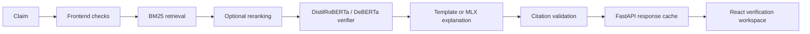

# Veritas Architecture

Veritas is a local-first claim verification system with two separate jobs:

1. classify the claim verdict with a measurable verifier
2. generate a grounded explanation that does not replace the verifier

## Live product pipeline

## Verdict classification

The verifier is the source of truth for the final label.

- Default checkpoint: `checkpoints/deberta_verifier_clean/`
- Baseline checkpoint: `checkpoints/transformer_verifier_clean/`
- Lightweight fallback: `checkpoints/verifier_clean/`
- Last-resort fallback: deterministic mock verifier

The browser UI shows the live verifier backend and the measured validation snapshot, but it does not decide the verdict itself.

## Retrieval

Live mode defaults to BM25.

- BM25 is the current browser-facing default
- Dense and hybrid retrieval modes exist behind configuration flags
- Cross-encoder reranking is optional
- Response caching keeps repeat claim checks fast

## Explanation generation

The explanation layer is for grounding and readability, not independent verdict prediction.

- Default behavior: template fallback
- Optional backend: MLX LoRA adapter for citation-grounded explanations
- Citation validation runs before the response returns

## What Is and Is Not Claimed

Veritas does claim:

- an end-to-end retrieval, verification, and explanation workflow
- measured verifier and retrieval validation metrics in the repo
- a production-style browser UI for claim review
- multiple backend paths with explicit fallbacks

Veritas does not claim:

- that explanation tuning improves verifier accuracy unless a report says so
- that the explanation adapter is production-grade
- that ONNX is faster on this machine
- that blocked QLoRA or DPO paths exist when they are marked as blocked

## Configuration

Important runtime keys:

- `retrieval_backend`: `bm25_only`, `sentence_transformer_hybrid`, or `bge_m3_hybrid`
- `verifier_checkpoint`: `checkpoints/deberta_verifier_clean`
- `verifier_aggregation`: `per_passage_max` or `bundle`
- `support_threshold`: verifier support threshold
- `refute_threshold`: verifier refute threshold
- `explanation_mode`: `template`, `mlx_lora`, or `preference_reranked`
- `max_claim_length`: browser and API claim-length guardrail

The checked-in reports are validation artifacts, not a claim of SOTA performance.
